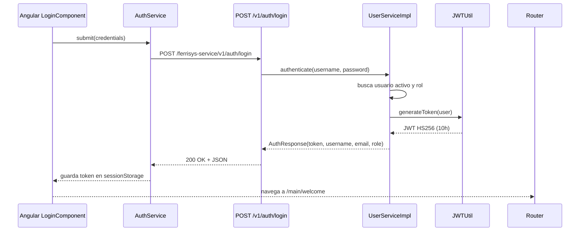
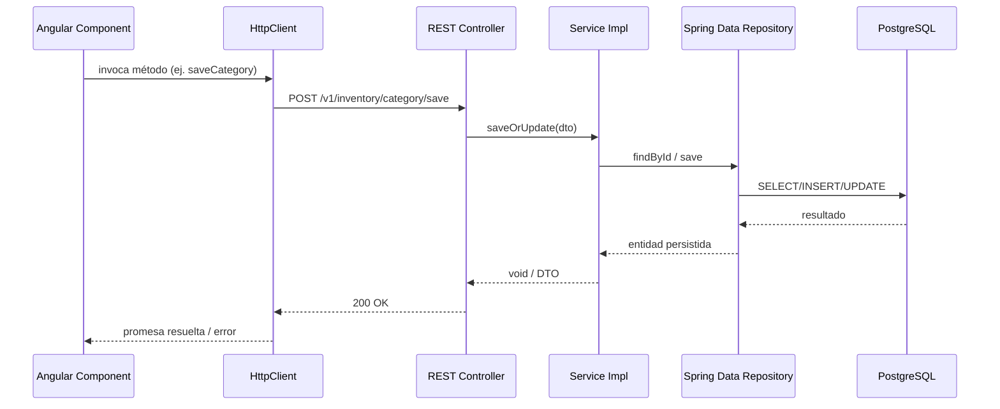

# 1. Visión general

La solución sigue un modelo cliente-servidor clásico. El frontend Angular consume APIs REST JSON expuestas por un backend Spring Boot desplegado bajo el contexto `/ferrisys-service`. El backend persiste datos en PostgreSQL (Supabase) usando Spring Data JPA.

# 2. Diagrama de componentes

```mermaid
flowchart LR
    subgraph Frontend [Frontend (Angular 19)]
        Login[LoginComponent]
        Layout[MainLayoutComponent]
        Services[AuthService / CategoryService / ProductService]
    end

    subgraph Backend [Backend (Spring Boot 3.4)]
        Controller[REST Controllers]
        ServicesB[Domain Services]
        Security[SecurityConfig + JwtFilterRequest]
        FeatureFlags[FeatureFlagServiceImpl]
        Repos[JPA Repositories]
    end

    subgraph Database [PostgreSQL]
        Tables[(Auth / Inventario / Negocio)]
    end

    Login -->|HTTP POST /v1/auth/login| Controller
    Layout -->|HTTP GET/POST CRUD| Controller
    Services -->|HttpClient| Controller
    Controller --> ServicesB --> Repos --> Tables
    ServicesB --> FeatureFlags
    FeatureFlags --> Repos
    Security -. valida token .-> Controller
```

# 3. Secuencia de login



# 4. Flujo CRUD típico



# 5. Decisiones de seguridad

- **Stateless JWT**: No se mantiene estado de sesión en el servidor; `SessionCreationPolicy.STATELESS`. 【F:back-costa/src/main/java/com/ferrisys/config/security/SecurityConfig.java†L24-L32】
- **Filtro personalizado**: `JwtFilterRequest` valida firma/caducidad, maneja errores de token y rellena el `SecurityContext` con `UserDetails`. 【F:back-costa/src/main/java/com/ferrisys/config/security/filter/JwtFilterRequest.java†L21-L63】
- **Authorities dinámicas**: `CustomUserDetailsService` crea authorities `ROLE_*` y `MODULE_*` basadas en `FeatureFlagService`, que consulta licencias (`module_license`) además del flag de configuración `modules.*.enabled`. 【F:back-costa/src/main/java/com/ferrisys/config/security/CustomUserDetailsService.java†L31-L68】【F:back-costa/src/main/java/com/ferrisys/service/impl/FeatureFlagServiceImpl.java†L17-L102】
- **CORS restringido**: Solo `http://localhost:4200` y `https://clarifyerp.qbit-gt.com` tienen acceso con métodos GET/POST/PUT/DELETE/PATCH/OPTIONS. 【F:back-costa/src/main/java/com/ferrisys/config/security/SecurityConfig.java†L33-L51】
- **Contraseñas**: Se almacenan con `BCryptPasswordEncoder` en los flujos de registro y cambio de contraseña. 【F:back-costa/src/main/java/com/ferrisys/service/impl/UserServiceImpl.java†L62-L73】【F:back-costa/src/main/java/com/ferrisys/service/impl/UserServiceImpl.java†L91-L117】

# 6. Paginación, validación y logging

- **Paginación**: Todos los listados usan `PageRequest` con respuesta `PageResponse<T>` (content, totalPages, totalElements, currentPage, pageSize). No hay validaciones de límites máximos. 【F:back-costa/src/main/java/com/ferrisys/service/impl/InventoryServiceImpl.java†L63-L76】
- **Validación**: Se realizan validaciones básicas (existencia de IDs, coincidencia de contraseñas). No se usan anotaciones Bean Validation en DTOs/controladores.
- **Logging**: No hay configuración dedicada; se apoya en logging estándar de Spring Boot. Frontend usa `console.log` para debug (debe limpiarse).

# 7. Observabilidad

- **Actuator**: El starter está incluido y se exponen `health` e `info` vía `management.endpoints.web.exposure.include`, pero además existe un `HealthController` custom que responde `"pong"` en `/actuator/health`, duplicando responsabilidad. 【F:back-costa/src/main/resources/application.yml†L47-L52】【F:back-costa/src/main/java/com/ferrisys/controller/HealthController.java†L7-L12】
- **Métricas**: No existen dashboards ni exportadores (Prometheus/Zipkin). Recomendado habilitar métricas y protegerlas con seguridad basada en roles/módulos.
- **Trazas**: No se implementa tracing distribuido.

# 8. Evolución a plataforma multi-vertical

## Dominios sugeridos (DDD ligero)
- **Catálogo**: Productos, categorías, atributos específicos por vertical.
- **Inventarios**: Existencias, movimientos, lotes.
- **Ventas**: Órdenes, facturación, pagos.
- **Compras**: Órdenes a proveedores, recepción.
- **Precios & Promociones**: Tarifas por vertical (mayoreo, ferretería, abarrotes).
- **Clientes & Proveedores**: Gestión de terceros y segmentación.
- **Caja & Finanzas**: Pagos, arqueos, conciliaciones.
- **Seguridad & Licencias**: Gestión de módulos habilitados por cliente.

## Estrategia backend
- Ya se usa `@ConditionalOnProperty("modules.<dominio>.enabled")` para habilitar controladores (inventario, clientes, compras, etc.); extender el patrón a nuevos dominios.
- `FeatureFlagServiceImpl` consulta `module_license` y licencias en memoria; falta incorporar noción explícita de tenant (actualmente usa `user.id`) y exponer APIs de administración de licencias.
- Añadir `tenant_id` (UUID) a entidades o separar por esquema (por ejemplo `tenant_<id>`). Comenzar con columna y filtros por `@EntityGraph`/`@Where`.
- Unificar `AuthUserRole` y `AuthRoleModule` con un catálogo de licencias para habilitar rutas.

## Estrategia frontend
- `MenuBuilderService` ya genera el menú a partir de los módulos almacenados en `SessionService`; es necesario alinear el endpoint para que entregue la estructura consumible.
- `PermissionGuard` valida módulos pero depende de que `SessionService` reciba datos reales; completar flujo de login para transformar el `PageResponse` en la lista de slugs esperada.
- Crear lazy modules por dominio (`catalog`, `sales`, `purchases`, etc.) y cargar solo los habilitados.

## Extensibilidad de catálogo
- Diseñar entidades con campos genéricos (`attributes` JSONB) para reglas por vertical (ej. calibre de ferretería, caducidad en abarrotes).
- Crear servicios plugin que apliquen validaciones específicas según `tenant.vertical`.

## Data governance
- Estandarizar auditoría (ya se usa `Auditable`) agregando `created_by` y `updated_by` mediante `AuditorAware`.
- Versionar migraciones con Flyway (baseline actual) y aplicar seeds por vertical (roles, módulos, catálogos base).
- Gestionar seeds multi-tenant mediante scripts idempotentes ejecutados tras habilitar una licencia.

# 9. Consideraciones adicionales

- **Persistencia**: Actualmente se usan búsquedas `findById().orElseThrow` sin manejo transaccional avanzado; al habilitar multi-tenant se deben añadir filtros globales.
- **Integración frontend-backend**: `AuthService.fetchEnabledModules()` hace `GET` a `/v1/auth/modules` y espera `string[]`, pero el backend expone `POST` con `PageResponse<ModuleDTO>`; `CategoryService`/`ProductService` usan IDs numéricos y rutas inexistentes. Se debe normalizar antes de habilitar consumo real. 【F:front-costa/src/app/services/auth.service.ts†L37-L46】【F:back-costa/src/main/java/com/ferrisys/controller/AuthRestController.java†L40-L52】【F:front-costa/src/app/services/category/category.service.ts†L7-L53】
- **Despliegue**: Dockerfiles existen para ambos módulos pero no se incluye orquestación. Se recomienda definir compose/k8s para despliegue multi-servicio.
