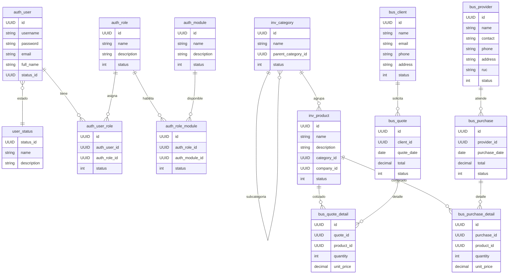

# 1. Modelo de datos actual

## 1.1 Esquema de autenticación

| Tabla | Campos principales | Relaciones |
|-------|--------------------|------------|
| `auth_user` | `id` (UUID), `username` único, `password` (BCrypt), `email`, `full_name`, `status_id`, timestamps | FK `status_id` → `user_status.status_id` |
| `user_status` | `status_id` (UUID), `name`, `description` | Referenciada por usuarios |
| `auth_role` | `id`, `name` único, `description`, `status` | Asociada a usuarios y módulos |
| `auth_module` | `id`, `name` único, `description`, `status` | Catálogo de módulos habilitables |
| `auth_user_role` | `id`, `auth_user_id`, `auth_role_id`, `status` | FK a usuario y rol |
| `auth_role_module` | `id`, `auth_role_id`, `auth_module_id`, `status` | FK a rol y módulo |
| `module_license` | `id`, `tenant_id`, `module_id`, `enabled`, `expires_at`, timestamps | FK `module_id` → `auth_module.id`; índice único `(tenant_id, module_id)` |

## 1.2 Esquema de inventario

| Tabla | Campos principales | Relaciones |
|-------|--------------------|------------|
| `inv_category` | `id`, `name` único, `description`, `parent_category_id`, `status`, auditoría | jerarquía simple por UUID padre |
| `inv_product` | `id`, `name`, `description`, `category_id`, `company_id`, `status`, auditoría | FK `category_id` → `inv_category.id` |

## 1.3 Esquema de negocio

| Tabla | Campos principales | Relaciones |
|-------|--------------------|------------|
| `bus_client` | `id`, `name`, `email`, `phone`, `address`, `status`, auditoría | — |
| `bus_provider` | `id`, `name`, `contact`, `phone`, `address`, `ruc`, `status`, auditoría | — |
| `bus_quote` | `id`, `client_id`, `description`, `quote_date`, `total`, `status`, auditoría | FK `client_id` → `bus_client.id` |
| `bus_quote_detail` | `id`, `quote_id`, `product_id`, `quantity`, `unit_price`, auditoría | FK a `bus_quote.id` y `inv_product.id` |
| `bus_purchase` | `id`, `provider_id`, `description`, `purchase_date`, `total`, `status`, auditoría | FK `provider_id` → `bus_provider.id` |
| `bus_purchase_detail` | `id`, `purchase_id`, `product_id`, `quantity`, `unit_price`, auditoría | FK a `bus_purchase.id` y `inv_product.id` |

## 1.4 Auditoría

Todas las entidades que extienden `Auditable` incluyen `created_at` y `updated_at` (set por callbacks `@PrePersist`/`@PreUpdate`). No se almacenan `created_by`/`updated_by`. 【F:back-costa/src/main/java/com/ferrisys/common/audit/Auditable.java†L14-L31】

# 2. Diagrama ER (Mermaid)

# 3. Convenciones e índices
- Claves primarias UUID generadas vía `org.hibernate.id.UUIDGenerator` en todas las entidades. 【F:back-costa/src/main/java/com/ferrisys/common/entity/user/User.java†L24-L31】
- Campos `status` (Integer) funcionan como soft delete (1 activo, 0 inactivo) sin índices dedicados.
- `inv_category.name` y `auth_module.name`/`auth_role.name` tienen restricciones `unique` aplicadas en JPA (deben confirmarse en DB).
- No existen índices explícitos para búsquedas por `username`, `email`, `status`; recomendable crear índices btree.

# 4. Recomendaciones de migraciones
- Ya se usa **Flyway** con `V1__baseline.sql` (esquema completo), `V2__seed_base.sql` (catálogos iniciales) y `V3__module_license.sql` (tabla de licencias). Mantener nuevas alteraciones como migraciones incrementales.
- Ampliar seeds para crear licencias de ejemplo por módulo/tenant (tabla `module_license`) alineadas con los UUID de `DefaultRole`/`DefaultUserStatus`.
- Añadir columnas `created_by` y `updated_by`, respaldadas por auditoría Spring Security (`AuditorAware`).
- Definir restricciones `ON DELETE` apropiadas (actualmente rely on cascada JPA). Ej.: `ON DELETE CASCADE` en detalles de compras/cotizaciones.
- Evaluar índice compuesto `(status, name)` en catálogos y `(status, provider_id)` en compras para acelerar filtros activos.
- Preparar scripts para soporte multi-tenant: agregar columna `tenant_id` (UUID) con índice compuesto `(tenant_id, status)`.
